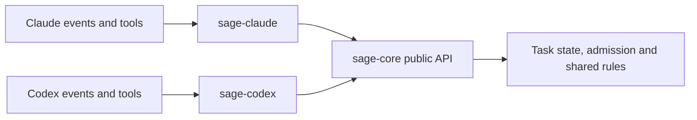

# Sage package boundaries

Sage has one shared rule system and one adapter for each host. The adapters
translate native events into shared operations. Core decides the shared rules;
the adapter translates the result back into the host's response format.

| Package | Owns | Must not own |
| --- | --- | --- |
| `sage-core` | Task states, board data, assignments, admission, role rules, briefs, shared instructions, principles, command reading and shared policy | Native tool names, host event formats, model names, host configuration paths, installation or hook responses |
| `sage-claude` | Claude identity and events, command fields, native responses, model defaults, hook manifests, launcher and installation | A second implementation of shared task or role rules; Codex code |
| `sage-codex` | Codex transport, identity evidence, event records, command fields, native responses, configuration, hook manifests and installation | A second implementation of shared task or role rules; Claude code |

## Data and authority

A provider verifies the native actor and event before calling core. Model text
cannot select an actor or provide authority. Core receives explicit project,
session, assignment, role, and operation data. Its decisions never depend on a
native event name. Core owns durable admission records; a provider owns the
native evidence used to bind an actual child to an assignment.

Provider settings supply storage roots and supported model defaults. Core does
not read a host's profile or import a host adapter. The board and task logbook
remain shared, with separate provider storage selected by configuration.

Shared role and chief text belongs in core. Provider bindings supply commands,
setup, and delivery details. Instructions describe the rules; executable policy
and tests must enforce rules that matter.

## Imports and build output

A provider imports shared code only from `sage-core`. It must not import a core
file by relative path or subpath, or import the other provider. Use ESM imports
and re-exports, including literal dynamic imports; CommonJS `require` of core
is not supported. Core imports its
own modules and platform libraries. Its public entry point is `index.mjs`.

`npm run check` analyzes static imports, re-exports, literal dynamic imports,
and literal require calls with esbuild. It rejects package-boundary violations
without running package code. It also rejects module URLs that could bypass
package resolution. The build uses a pinned ES module lexer to rewrite public
core imports in either quote style, without rewriting comments or string data.
Computed module paths are outside that analysis;
never derive a code path from model text or a native tool request.

The build creates `plugins/sage/` from core plus the Claude adapter, and
`plugins/sage-codex/` from core plus the Codex adapter. Those folders are output,
not another source layer. Tests run each bundle outside the checkout.

## Current migration

Task state, the board, assignments, admission, role rules, brief validation,
principles, shared role text, command reading, and merge-command classification already live in core. The
command reader is the existing implementation; this move changes no shell grammar.

The shared command policy takes a trusted state-tool path from each provider.
A recognized merge is only a candidate; mode, role and ledger checks still decide
whether it can run. An omitted path grants no state-tool text exception.

The Claude hook still combines native handling with other command, push, logbook-write,
and workflow policies. Extract those rules into core behind explicit operation
contracts, then change each provider to call them. Keep native identity and event
correlation in each provider. Do not move native transport code into core merely
to reduce adapter size.

The Codex composition currently joins capture, admission, and child delivery.
It still requires a complete tool-policy callback, lifecycle recovery, chief
activation, installation, and a real-project pilot. Its automatic implementation
is not installed. Package separation does not establish runtime readiness.

Keep the queued issue order and one PR per issue. Migrate a rule with its callers
and tests; do not maintain two copies or claim that moving it fixes an open issue.
